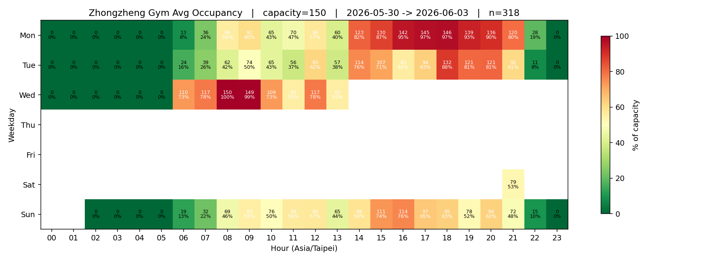

# 中正運動中心健身房 報告

資料區間: `2026-05-30 -> 2026-06-03`, 共 **318** 筆觀測，capacity = **150** 人

## 最空的時段 (top 10)

| 時段 | 平均人數 | 使用率 |
|---|---:|---:|
| Mon 00:00 | 0 人 | 0% |
| Mon 01:00 | 0 人 | 0% |
| Mon 02:00 | 0 人 | 0% |
| Mon 03:00 | 0 人 | 0% |
| Mon 04:00 | 0 人 | 0% |
| Mon 05:00 | 0 人 | 0% |
| Tue 02:00 | 0 人 | 0% |
| Mon 23:00 | 0 人 | 0% |
| Tue 04:00 | 0 人 | 0% |
| Tue 01:00 | 0 人 | 0% |

## 最擠的時段 (top 10)

| 時段 | 平均人數 | 使用率 |
|---|---:|---:|
| Wed 08:00 | 150 人 | 100% |
| Wed 09:00 | 149 人 | 99% |
| Mon 18:00 | 146 人 | 97% |
| Mon 17:00 | 145 人 | 97% |
| Mon 16:00 | 142 人 | 95% |
| Mon 19:00 | 139 人 | 93% |
| Mon 20:00 | 136 人 | 90% |
| Tue 18:00 | 132 人 | 88% |
| Mon 15:00 | 130 人 | 87% |
| Mon 14:00 | 123 人 | 82% |